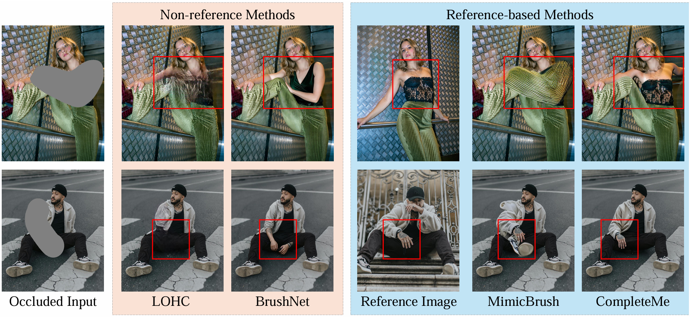

# 🌺ICCV 2025🌺 *CompleteMe*: Reference-based Human Image Completion

[Yu-Ju Tsai](https://liagm.github.io/), 
[Brian Price](https://research.adobe.com/person/brian-price/), 
[Qing Liu](https://qliu24.github.io/),
[Luis Figueroa](https://research.adobe.com/person/luis-figueroa/),
[Daniil Pakhomov](https://research.adobe.com/person/daniil-pakhomov/),
[Zhihong Ding](https://research.adobe.com/person/zhihong-ding/),
[Scott Cohen](https://research.adobe.com/person/scott-cohen/),
[Ming-Hsuan Yang](https://faculty.ucmerced.edu/mhyang/)
<br>
University of California, Merced - Adobe Research

[&label=CompleteMe&labelColor=%23f5f5dc&color=hsl(204%2C%2086%25%2C%2053%25))](https://liagm.github.io/CompleteMe/)
[](https://arxiv.org/abs/2504.20042)
<!--[](https://youtu.be/lf0Gck9UOcU)  -->

<div align='center'>

</div>

> Given occluded human images, *CompleteMe* can preserve identical and fine-detail information from the reference image and generate a consistent result.

## News  ✨ ✨ 
- **[2025-10-25]** Our code is under internal review.
- **[2025-06-25]** Our paper is accepted by **ICCV 2025**.

## Citation

If you find our work useful for your project, please consider citing our paper.

```
@article{tsai2025completeme,
        title={CompleteMe: Reference-based Human Image Completion},
        author={Tsai, Yu-Ju and Price, Brian and Liu, Qing and Figueroa, Luis and Pakhomov, Daniil and Ding, Zhihong and Cohen, Scott and Yang, Ming-Hsuan},
        journal={arXiv preprint arXiv:2504.20042},
        year={2025}
      }
```
